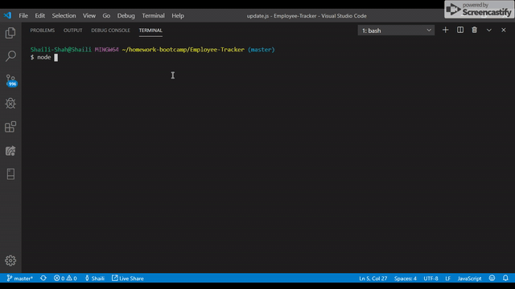

# Employee-Tracker

This application can be used to view ,add and update Emplyee role, department, and genral information.

# Author
Shaili Shah | 
[LinkedIn](https://www.linkedin.com/in/shaili-shah-88706512b/) 
| [GitHub](https://github.com/sshaili) 

# Technologies

* HTML
* CSS 
* JavaScript
* JQuery
* Node js
* EXPRESS

# Repositories
click here for Live Demo :  https://github.com/sshaili/Note--Taker

# Heroku link
Click here for the heroku link : https://stormy-taiga-42180.herokuapp.com/

# Assumption

Node.js and node global packages installed in your environement.

# NPM Dependencies

* Inquirer
* mySql

# To run the application

No 1. Run `npm install`.

No 2. Run `node EmployeeTracker.js`

# Application Feature

* View ALL Employees
* View Employees by Department
* View Employees by Roles
* View Departments
* View Roles
* Add Employee
* Add Departments
* Add Role
* Update Employee roles
* Exit application

# Application Feature Demo

